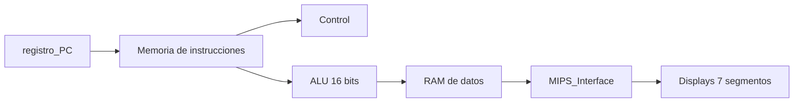

# Procesador MIPS Monociclo en VHDL sobre FPGA

Diseño, simulación e implementación de un **procesador MIPS monociclo** descrito en **VHDL**, desarrollado con **Xilinx Vivado** e implementado sobre una **FPGA Nexys4 DDR**.

Proyecto de la asignatura **Estructura de Computadores** (Grado en Ingeniería Informática del Software, Universidad de Extremadura), desarrollado de forma incremental a lo largo de cinco sesiones de laboratorio.

**Tecnologías:** VHDL, Xilinx Vivado 2015.1, FPGA Nexys4 DDR (Artix-7), simulación con testbenches, análisis RTL, arquitectura MIPS

---

## Qué hace

El proyecto construye un procesador MIPS completo partiendo de sus componentes básicos: multiplexores, decodificadores, ALU, contador de programa y memorias. Estos módulos se integran en un núcleo monociclo que se conecta a una interfaz de E/S y se carga en una FPGA real, donde los resultados de la ejecución se visualizan en los displays de 7 segmentos de la placa.

Cada módulo se verificó mediante **testbenches** y **análisis RTL** antes de integrarse en el siguiente nivel.

---

## Evolución del proyecto

| Sesión | Carpeta | Módulos desarrollados |
|---|---|---|
| 1 | `Lab1_EC` | Multiplexor 4 a 1 de 4 bits, decodificador 2 a 4, codificador hexadecimal a 7 segmentos y control de displays (`Seldigit_CodLEDS`) |
| 2 | `Lab2_EC` | ALU de 16 bits (`ALU16bits`) y registro contador de programa (`registro_PC`) con sus testbenches |
| 3 | `Lab3_EC` | Memoria de instrucciones (`Mem_Ia_256x8`) y memoria RAM de datos (`ram_datos`) |
| 4 | `Lab4_EC` | Núcleo del procesador (`Mips_nucleo1`), descrito de forma estructural uniendo todos los módulos |
| 5 | `Lab5_EC` | Interfaz de E/S (`MIPS_Interface`), síntesis, implementación y ejecución en la FPGA |



---

## Estructura del repositorio

Cada carpeta `LabX_EC` es un proyecto de Vivado independiente. El código fuente se encuentra en las carpetas `.srcs`:

```
LabX_EC/
├── LabX_EC.xpr          Proyecto de Vivado
└── LabX_EC.srcs/
    ├── sources_1/       Módulos VHDL
    ├── sim_1/           Testbenches
    └── constrs_1/       Restricciones de pines de la FPGA (.xdc)
```

Las carpetas generadas por Vivado (`.cache`, `.runs`, `.sim`, `.hw`) no se incluyen, ya que se recrean automáticamente al abrir el proyecto.

La documentación técnica completa, con el código comentado, capturas del análisis RTL, resultados de simulación, utilización de recursos de la FPGA y fotos de la placa en funcionamiento, está en `documentacion.pdf`.

---

## Cómo abrirlo

1. Instala **Xilinx Vivado** (el proyecto se creó con la versión 2015.1; versiones posteriores ofrecen actualizar el proyecto automáticamente).
2. Clona el repositorio:
   ```bash
   git clone https://github.com/jmm-21/mips-processor-vhdl.git
   ```
3. Abre el archivo `.xpr` de la sesión que quieras, por ejemplo `Lab5_EC/Lab5_EC.xpr` para el procesador completo.
4. Para simular: *Run Simulation > Run Behavioral Simulation*.
5. Para cargarlo en una Nexys4 DDR: *Generate Bitstream* y después *Open Hardware Manager > Program Device*.

---

## Autores

Proyecto desarrollado en pareja por:

- **Jorge Méndez Martínez** 
- **José Manuel Pecero Blanco**
